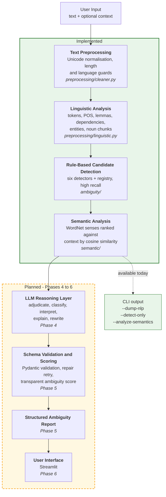
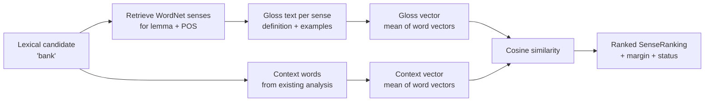

# AmbiSense — NLP-Based Ambiguity Detection and Resolution System

> **Status: Work in progress (Phase 3 of 8 complete).**
> This repository currently contains the configuration foundation, the
> traditional NLP analysis layer, the rule-based ambiguity **candidate**
> detection layer, and the context-based WordNet sense-ranking layer. LLM
> integration, ambiguity scoring, the web interface and evaluation are **not
> implemented yet** and are clearly marked as planned throughout this
> document.

---

## Table of Contents

1. [Project Overview](#1-project-overview)
2. [Problem Statement](#2-problem-statement)
3. [Motivation](#3-motivation)
4. [Project Objectives](#4-project-objectives)
5. [How Ambiguity Works](#5-how-ambiguity-works)
6. [Types of Ambiguity the Project Will Handle](#6-types-of-ambiguity-the-project-will-handle)
7. [Proposed System Architecture](#7-proposed-system-architecture)
8. [Current Implementation Status](#8-current-implementation-status)
9. [Phase 0 — Foundation](#9-phase-0--foundation-complete)
10. [Phase 1 — Schemas and NLP Layer](#10-phase-1--schemas-and-nlp-layer-complete)
11. [Phase 2 — Rule-Based Ambiguity Detection](#11-phase-2--rule-based-ambiguity-detection-complete)
12. [Phase 3 — Semantic Analysis](#12-phase-3--semantic-analysis-complete)
13. [Installation](#13-installation)
14. [Current CLI Usage](#14-current-cli-usage)
15. [Example Commands](#15-example-commands)
16. [Example NLP Output](#16-example-nlp-output)
17. [Configuration](#17-configuration)
18. [Environment Variables](#18-environment-variables)
19. [Testing](#19-testing)
20. [Project Structure](#20-project-structure)
21. [Design Decisions](#21-design-decisions)
22. [Known Limitations](#22-known-limitations)
23. [Planned Development Phases](#23-planned-development-phases)
24. [Technology Stack](#24-technology-stack)
25. [Future Work](#25-future-work)
26. [License](#26-license)

---

## 1. Project Overview

AmbiSense is an academic prototype that aims to detect ambiguity in English
text, explain why the ambiguity occurs, and suggest clearer rewrites.

The intended design is a **hybrid pipeline**: traditional NLP techniques locate
*candidate* ambiguities using observable linguistic structure, and a Large
Language Model, accessed through an API, then judges whether each candidate is
a genuine ambiguity and produces the interpretations, explanations and
rewrites.

The two components have deliberately separate responsibilities. Rule-based
analysis answers *"where in this sentence is there a structural reason to
suspect more than one reading?"* The LLM answers *"is that reading actually
available to a human reader, and how would you phrase it unambiguously?"*

**What exists today** is the whole evidence-gathering half of that pipeline:
configuration management, input validation, spaCy linguistic analysis,
rule-based candidate detection, and context-based WordNet sense ranking. What
remains is the reasoning half - the LLM adjudication layer and everything after
it - described in [Section 23](#23-planned-development-phases).

---

## 2. Problem Statement

A sentence is **ambiguous** when it has more than one legitimate
interpretation, and the text alone does not determine which one is intended.

```
I saw the man with the telescope.
```

This sentence has two available readings:

- The speaker used a telescope in order to see the man.
- The man the speaker saw was carrying a telescope.

Both readings are grammatically valid. Nothing in the sentence resolves the
question. A human reader usually settles it from context — or fails to notice
the ambiguity at all, which is precisely what makes ambiguity dangerous in
requirements documents, legal text, medical instructions and technical
specifications.

Automatic detection is difficult because:

- A parser typically commits to **one** parse and discards the alternatives,
  so the ambiguity becomes invisible after parsing.
- Most words are technically polysemous, so naive dictionary-based detection
  flags almost every sentence and is therefore useless.
- Not every unclear sentence is ambiguous. Vagueness, underspecification and
  missing context are different problems that require different responses.

This project treats those three difficulties as the core design challenge
rather than as edge cases.

---

## 3. Motivation

Ambiguity is not merely a linguistic curiosity; it has practical cost:

- **Requirements engineering.** An ambiguous specification produces software
  that satisfies the sentence but not the intent.
- **Legal and policy text.** Competing readings of the same clause are a
  recurring source of dispute.
- **Technical writing and documentation.** A reader who picks the wrong
  reading follows the wrong procedure.
- **Language learning.** Learners benefit from seeing *why* a sentence can be
  read in two ways, not just being told it is unclear.

There is also a research motivation. Modern LLMs are strong at explaining
ambiguity in fluent prose but will readily produce a confident explanation for
a sentence that is not actually ambiguous. Traditional NLP is the opposite: it
can reliably identify structural configurations that *permit* two readings, but
cannot tell whether the second reading is plausible to a human. Combining them
lets each component compensate for the other's characteristic failure mode.

---

## 4. Project Objectives

1. Build a modular NLP pipeline that separates linguistic description from
   ambiguity judgement.
2. Extract observable linguistic evidence — POS tags, dependency relations,
   named entities, noun phrases — using established NLP tooling.
3. Implement rule-based detectors for the six ambiguity types listed below.
   *(Implemented — Phase 2.)*
4. Use word-sense information and embeddings to analyse whether supplied
   context favours one reading. *(Implemented — Phase 3.)*
5. Integrate an LLM through an API so that it reasons over the NLP evidence
   rather than over the raw sentence alone. *(Planned — Phase 4.)*
6. Enforce a strict, validated output schema instead of accepting free-form
   LLM text. *(Schema implemented in Phase 1; the LLM that fills it is
   planned for Phase 4.)*
7. Distinguish ambiguity from vagueness, underspecification and insufficient
   context.
8. Provide a transparent, explainable ambiguity score. *(Planned — Phase 5.)*
9. Evaluate the system on a labelled dataset and report honest metrics.
   *(Planned — Phase 7.)*
10. Document limitations truthfully rather than overstating capability.

---

## 5. How Ambiguity Works

Ambiguity arises when a single surface form maps onto more than one underlying
structure or meaning. It is useful to distinguish it from three neighbouring
phenomena, because a system that conflates them will report false positives
constantly.

| Phenomenon | Definition | Example | Is it ambiguity? |
|---|---|---|---|
| **Ambiguity** | Two or more distinct, well-formed readings | "I saw the man with the telescope." | Yes |
| **Vagueness** | One reading, but with imprecise boundaries | "The movie was good." | No — *good* is subjective, not double-meaning |
| **Underspecification** | One reading, with detail omitted | "They arrived late." | No — we simply are not told who or how late |
| **Insufficient context** | Reading depends on information outside the text | "Put it on the table." | No — *it* is unresolved, not double-meaning |

The practical consequence for this project: a sentence being *unclear* is not
sufficient grounds to report ambiguity. The system must be able to answer
"unclear, but not ambiguous" and to answer "I cannot confidently classify
this". The `ClarityVerdict` and `AmbiguityType.UNKNOWN` values in
[`schemas.py`](src/ambisense/schemas.py) exist specifically to make those two
answers expressible.

---

## 6. Types of Ambiguity the Project Will Handle

> **Status:** all six categories are defined in the schema
> ([`AmbiguityType`](src/ambisense/schemas.py)) and each now has a working
> rule-based **candidate detector** (Phase 2). Those detectors propose
> candidates only - deciding whether a candidate is a genuine ambiguity, and
> producing the interpretations, remains planned work for Phase 4.

### 6.1 Lexical ambiguity

A single word carries more than one meaning.

```
I went to the bank.
```

- A financial institution.
- The sloping land beside a river.

**Implemented signal** (`ambiguity/lexical.py`): words with several distinct
WordNet senses for their part of speech, **and** senses spread across several
distinct WordNet semantic domains, filtered against a stoplist of words that
are technically polysemous but practically unambiguous.

### 6.2 Syntactic ambiguity

The same word sequence supports more than one grammatical structure.

```
I saw the man with the telescope.
```

- The prepositional phrase attaches to the verb — the telescope was the
  instrument of seeing.
- The prepositional phrase attaches to the noun — the man had the telescope.

A second variety is coordination scope:

```
The old men and women sat outside.
```

- Old men, and women of any age.
- Old men and old women.

**Implemented signal** (`ambiguity/syntactic.py`): dependency-parse
configurations in which an alternative attachment point is structurally
available - specifically, a competing noun lying between the verb and the
preposition, or a modifier on a coordinated noun.

### 6.3 Referential ambiguity

A pronoun or referring expression has more than one possible antecedent.

```
John told David that he was late.
```

- *he* = John.
- *he* = David.

**Implemented signal** (`ambiguity/referential.py`): a pronoun with two or
more antecedent candidates that survive number and animacy agreement
filtering, using the `is_plural` and `is_animate_candidate` attributes
recorded during noun-chunk extraction.

### 6.4 Semantic ambiguity

The sentence is structurally clear but the semantic roles are not fixed.

```
The chicken is ready to eat.
```

- The chicken is about to eat something (chicken = agent).
- The chicken is ready to be eaten (chicken = patient).

**Implemented signal** (`ambiguity/semantic.py`): an adjective from a
configured list followed by a to-infinitive whose verb has no expressed
object, excluding verbs that cannot take an object at all. Noun-noun compounds
are also flagged, with a lower signal strength.

### 6.5 Scope ambiguity

Quantifiers and negation can take scope over one another in more than one order.

```
Every student didn't submit the assignment.
```

- No student submitted it (negation scopes over the quantifier).
- Not all students submitted it (the quantifier scopes over negation).

**Implemented signal** (`ambiguity/scope.py`): co-occurrence of a quantifier
with a negation, or with a second quantifier, within the **same clause** -
verified by walking the dependency tree up to each token's governing verb.

### 6.6 Pragmatic / contextual ambiguity

The literal meaning and the intended communicative act differ.

```
Can you open the window?
```

- A literal question about physical ability.
- A polite request to open the window.

**Implemented signal** (`ambiguity/pragmatic.py`): a modal auxiliary with a
second-person subject, an action verb (stative verbs excluded) and a question
mark; or a conventional indirect marker such as "would you mind".

**An honest caveat.** These six categories overlap, and linguists disagree
about their boundaries. The system is designed to return `unknown` rather than
force a confident label onto a case it cannot classify.

**A second caveat.** The detectors report *structural possibility*, not
ambiguity. They are deliberately tuned for high recall and produce false
positives - see [Known Limitations](#22-known-limitations) for measured
examples.

---

## 7. Proposed System Architecture

The diagram shows the **complete planned** pipeline. Only the components
marked *IMPLEMENTED* exist in this repository today.



### Why this shape

The central architectural claim is that the LLM must **not** be the first thing
the text touches. A `User → LLM → Answer` design would make the project an API
wrapper, and it would inherit the LLM's tendency to explain ambiguity that is
not there.

Instead, the rule-based layer is tuned for **high recall and low precision** —
it deliberately over-flags — and the LLM acts as the **precision filter** that
rejects candidates which are structurally possible but not humanly plausible.
Two components with opposite error profiles are composed so that each covers
the other's weakness.

A secondary benefit: because the NLP layer produces findings independently, the
planned system can degrade to an NLP-only report when the API is unavailable,
rather than failing outright. The `allow_degraded_mode` switch already exists
in the configuration in anticipation of this. *(The degraded path itself is
Phase 5 work.)*

---

## 8. Current Implementation Status

| Component | Status | Location |
|---|---|---|
| Configuration loading and validation | **Implemented** | `src/ambisense/config.py` |
| Logging setup | **Implemented** | `src/ambisense/logging_setup.py` |
| Shared Pydantic schemas (all layers) | **Implemented** | `src/ambisense/schemas.py` |
| Input validation and normalisation | **Implemented** | `src/ambisense/preprocessing/cleaner.py` |
| spaCy linguistic analysis | **Implemented** | `src/ambisense/preprocessing/linguistic.py` |
| Rule-based ambiguity detectors (6) | **Implemented** | `src/ambisense/ambiguity/` |
| Detector registry + deduplication | **Implemented** | `src/ambisense/ambiguity/registry.py` |
| WordNet sense/domain counting | **Implemented** | `src/ambisense/ambiguity/wordnet_support.py` |
| WordNet glosses and sense retrieval | **Implemented** | `src/ambisense/semantic/wordnet_senses.py` |
| Embeddings / cosine similarity | **Implemented** | `src/ambisense/semantic/embeddings.py` |
| Context-based sense ranking | **Implemented** | `src/ambisense/semantic/context_resolver.py` |
| CLI: `--check-config`, `--dump-nlp`, `--detect-only`, `--analyze-semantics` | **Implemented** | `main.py` |
| Automated tests (197) | **Implemented** | `tests/` |
| LLM API client and providers | *Planned — Phase 4* | — |
| Prompt files | *Planned — Phase 4* | — |
| Structured LLM reasoning and repair retry | *Planned — Phase 4* | — |
| Ambiguity scoring | *Planned — Phase 5* | — |
| End-to-end context-aware analysis | *Planned — Phase 5* | — |
| Streamlit user interface | *Planned — Phase 6* | — |
| Evaluation dataset | *Planned — Phase 7* | — |
| Evaluation metrics | *Planned — Phase 7* | — |
| Deployment | *Not planned for this submission* | — |

**Note on empty directories.** `app/`, `prompts/`, `docs/`, `data/examples/`
and `data/evaluation/` exist in the repository but are currently empty. The
package directories `llm/`, `llm/providers/`, `scoring/` and `evaluation/`
contain only an `__init__.py` placeholder. They are scaffolding for the phases
above, not implemented modules.

---

## 9. Phase 0 — Foundation (Complete)

Phase 0 established configuration, dependency management and logging.

| File | Purpose |
|---|---|
| `requirements.txt` | Dependencies grouped by role with comments explaining each |
| `pyproject.toml` | Declares `src/ambisense` as an installable package |
| `config/config.yaml` | Central configuration: model names, thresholds, weights, detector switches |
| `.env.example` | Template for secrets; the real `.env` is git-ignored |
| `.gitignore` | Excludes `.env`, `.venv/`, caches and build artefacts |
| `src/ambisense/config.py` | Loads YAML into a typed `Settings` tree; reads secrets from the environment |
| `src/ambisense/logging_setup.py` | Namespaced, idempotent logger configuration |

### Packaging

`pyproject.toml` declares a `src/` layout package so that both `main.py` and
the planned Streamlit app can `from ambisense... import ...` after a single
editable install. This avoids `sys.path` manipulation, which is a common source
of import failures when the same project is launched from two different entry
points.

### Configuration design

Every threshold, model name and weight lives in `config/config.yaml`. No
numeric threshold is hard-coded in `src/`. Configuration is parsed into nested
Pydantic models (`LLMConfig`, `NLPConfig`, `DetectorsConfig`, `ScoringConfig`
and others), so a typo in the YAML produces a validation error naming the
field, rather than a `KeyError` later during analysis.

Note that `config.yaml` already contains settings for planned components — for
example detector thresholds and scoring weights. Those sections are read and
validated today, but nothing consumes them yet.

### Logging

`configure_logging()` is idempotent. This matters for the planned Streamlit
interface, which re-executes the script on every user interaction and would
otherwise attach a duplicate handler each time, producing repeated log lines.

---

## 10. Phase 1 — Schemas and NLP Layer (Complete)

### 10.1 Shared schemas — `src/ambisense/schemas.py`

A single module defines every model that crosses a layer boundary, in four
groups:

1. **Linguistic models** — `TokenInfo`, `SentenceInfo`, `EntityInfo`,
   `NounChunkInfo`, `LinguisticAnalysis`.
2. **Detection models** — `AmbiguityCandidate`, the object the planned
   detectors will emit.
3. **Semantic models** — `SenseOption`, `SenseRanking`, for the planned
   WordNet layer.
4. **LLM contract and report models** — `Interpretation`, `AmbiguityFinding`,
   `LLMAnalysis`, `ScoreBreakdown`, `PipelineDiagnostics`, `AmbiguityReport`.

Groups 2, 3 and 4 are **defined but not yet produced by any code**. They are
written now because the schema is the interface between layers: fixing it early
means each subsequent phase has an explicit contract to implement against.

The models include defensive validators that exist because language models
return imperfect JSON in practice — a type string such as `"structural"`
instead of `"syntactic"`, a confidence expressed as `85` instead of `0.85`, or
a single string where a list is expected. `AmbiguityType.coerce()` maps
recognised near-misses onto known categories and returns `UNKNOWN` for anything
else, which is a truthful answer rather than a guess.

### 10.2 Input validation — `src/ambisense/preprocessing/cleaner.py`

This layer runs **before** any expensive work — before the spaCy model loads,
before any planned WordNet lookup or API call — so that bad input fails
immediately and cheaply, with a message the user can act on.

It performs:

- **Unicode normalisation** (NFKC) and replacement of typographic characters
  such as curly quotes, en/em dashes and non-breaking spaces with ASCII
  equivalents. These characters interfere with parsing and with character
  offsets.
- **Whitespace collapsing**, without altering wording.
- **Emptiness and minimum-length checks.**
- **Maximum-length truncation** at a word boundary, which produces a warning
  rather than an error so that long input degrades instead of failing.
- **An English-only guard**, implemented as the proportion of alphabetic
  characters that are ASCII. Text in Devanagari, Cyrillic or CJK scripts scores
  near zero and is rejected with an explanatory message; English containing a
  few accented characters still passes. This is a deliberately crude heuristic,
  not language identification — see [Known Limitations](#20-known-limitations).
- **Optional context normalisation**, with its own length limit.

Crucially, all offsets reported downstream refer to the *normalised* string,
which is also the string shown back to the user. The two therefore cannot drift
apart, which is what makes reliable span highlighting possible in the planned
interface.

### 10.3 Linguistic analysis — `src/ambisense/preprocessing/linguistic.py`

#### Why spaCy

spaCy provides tokenisation, sentence segmentation, POS tagging,
lemmatisation, dependency parsing and named entity recognition from a single
pipeline in one pass. The planned detectors need all of these, and obtaining
them from one tool avoids reconciling different tokenisations between
libraries — a real source of bugs when, for example, a POS tagger and a parser
disagree about token boundaries.

The `en_core_web_md` model was chosen over `en_core_web_sm` because it ships
300-dimensional word vectors. The planned semantic layer needs embeddings, and
taking them from the model that is already loaded avoids adding a second,
much heavier dependency.

#### What is extracted, and what will consume it

| Technique | Planned consumer |
|---|---|
| Tokenisation | Every detector — span boundaries and character offsets |
| Sentence segmentation | Referential detector — the antecedent search window |
| POS tagging | Lexical detector — WordNet lookup is part-of-speech specific |
| Lemmatisation | WordNet lookup and stoplist matching |
| Dependency parsing | Syntactic and scope detectors — attachment and clause structure |
| Named entity recognition | Referential detector — antecedent candidates |
| Noun-chunk extraction | Referential detector — antecedent candidates |
| Word vectors | Semantic layer — similarity between context and sense glosses |

Two additional attributes are computed per noun chunk, both consumed by the
referential detector: `is_plural` (from the fine-grained tag and morphological
features) and `is_animate_candidate` (from NER labels plus a documented lexicon
of role nouns such as *manager* and *developer*, since spaCy's NER labels only
*named* people, not *the manager*).

`is_animate_candidate` was called `is_person` until Phase 2. The name was
changed because the underlying check also accepts `ORG` and `NORP` entities:
"The company said **it** would release the patch" takes a pronoun, but a
company is not a person. The detection logic was not altered - only the name,
so that the referential detector builds on an accurately described field.

#### An illustrative point about why detection is needed

For "I saw the man with the telescope.", spaCy attaches the preposition *with*
to *man*. It has silently committed to one of the two available readings and
discarded the other. The parse itself therefore does not reveal the ambiguity;
the planned detector's job is to recognise that an alternative attachment was
structurally available. This is the concrete reason the project needs a
detection layer rather than just a parser.

**This layer makes no judgement about ambiguity.** It only describes the
sentence.

---

## 11. Phase 2 — Rule-Based Ambiguity Detection (Complete)

Phase 2 adds the layer that decides **where to look**. It contains no LLM call,
no network access and no randomness.

### 11.1 Candidate-generation philosophy

A detector answers one question only:

> Is there a *structural* reason to suspect more than one reading here?

It does **not** answer "is this sentence genuinely ambiguous?". That
distinction is the core of the design. Consider the parse the system actually
produces for the telescope sentence:

```
I saw the man with the telescope.   ->   with -> man
```

The parser committed to the noun-attachment reading and discarded the other
one. The ambiguity is invisible *after* parsing, so the detector's job is to
notice that an alternative attachment was structurally available - regardless
of which one the parser happened to pick.

### 11.2 The high-recall approach, and why

The detectors are deliberately tuned for **high recall and low precision**.
They over-flag. The Phase 4 LLM will act as the precision filter.

This is a deliberate composition of two components with opposite error
profiles:

| Component | Good at | Bad at |
|---|---|---|
| Rule-based detectors | Finding every structure that *permits* two readings; deterministic and explainable | Judging whether a reading is plausible to a human |
| LLM (Phase 4) | Judging plausibility, explaining, rewriting | Reliably noticing structure; will confidently explain ambiguity that is not there |

Neither is adequate alone. Chaining them lets each cover the other's
characteristic failure.

### 11.3 The six detectors

| Detector | Rule(s) | Signal strength |
|---|---|---|
| `lexical` | WordNet sense count **and** semantic-domain spread, minus stoplist, capped per sentence | 0.5 – 1.0 |
| `syntactic` | PP attachment (competing noun between verb and preposition); coordination scope | 0.75 / 0.65 |
| `referential` | Pronoun with ≥2 antecedents surviving number and animacy filters | 0.55 – 0.95 |
| `semantic` | Tough construction (ADJ + to-infinitive with no object); noun-noun compound | 0.70 / 0.35 |
| `scope` | Quantifier + negation, or two quantifiers, in the **same clause** | 0.80 / 0.60 |
| `pragmatic` | Modal + second-person subject + action verb + "?"; conventional indirect markers | 0.70 / 0.50 |

Each detector emits zero or more `AmbiguityCandidate` objects carrying a span,
character offsets, a machine-readable `evidence` dictionary and a
human-readable `explanation`.

### 11.4 What "signal strength" means

`AmbiguityCandidate.prior` is **the strength of the linguistic evidence**. It
is *not* a probability that the sentence is ambiguous, and the CLI says so
explicitly in its output footer.

It is computed deterministically from the rule that fired - for the lexical
detector, from the sense and domain counts; for the referential detector, from
how many antecedents survived filtering. It is used to rank candidates and to
apply the per-sentence cap, and it is passed to the LLM as evidence. A real
probability would require calibration against labelled data, which is Phase 7
work and has not been done.

### 11.5 The registry

`DetectorRegistry` reads `config.detectors`, instantiates only the enabled
detectors, runs them all against the same `LinguisticAnalysis`, and returns a
deduplicated, deterministically ordered list.

Two behaviours worth noting:

- **A failing detector does not abort the run.** An exception inside one rule
  is logged and that detector is skipped, so a single bad rule cannot cost the
  user every other detector's findings. This is covered by a test.
- **Deduplication merges only identical findings** - same span, same ambiguity
  type, *and* same rule. Two different ambiguity types on the same span are
  kept separate, because a word can legitimately be both a lexical and a
  syntactic candidate, and collapsing them would destroy information the LLM
  needs. When two detectors agree on one finding, the stronger signal is kept
  and the other detector is recorded in `evidence["also_detected_by"]`.

### 11.6 Determinism

Identical input produces byte-identical output: detectors run in declaration
order, and results are sorted by `(position, -strength, type, detector)`, a
total ordering with no ties left to chance. This matters because the same code
path will be used by the Phase 7 evaluation, where a non-reproducible result
would make measured metrics meaningless.

### 11.7 Files added

| File | Purpose |
|---|---|
| `ambiguity/base.py` | `Detector` abstract base class, span and dependency-tree helpers |
| `ambiguity/registry.py` | Config-driven registry, deduplication, deterministic ordering |
| `ambiguity/wordnet_support.py` | WordNet sense and semantic-domain counting, with graceful degradation |
| `ambiguity/lexical.py` | Lexical detector |
| `ambiguity/syntactic.py` | PP-attachment and coordination-scope detector |
| `ambiguity/referential.py` | Pronoun antecedent detector |
| `ambiguity/semantic.py` | Tough-construction and noun-compound detector |
| `ambiguity/scope.py` | Quantifier/negation scope detector |
| `ambiguity/pragmatic.py` | Indirect speech-act detector |

Detectors receive plain Pydantic models and never import spaCy - the
Doc-isolation decision from Phase 1 is preserved.

---

## 12. Phase 3 — Semantic Analysis (Complete)

Phase 2 answers *where* to look. Phase 3 asks a narrower question about lexical
candidates specifically:

> Given the words around it, which of this word's dictionary senses best
> matches the context?

### 12.1 Why Phase 2 alone is not enough

The lexical detector flags `bank` in "I deposited money at the bank." because
WordNet records ten noun senses spread over five semantic domains. That is all
it can say. It has no way to notice that *deposited* and *money* are sitting
right next to it. Phase 3 adds exactly that.

### 12.2 The method



**Sense retrieval.** Senses are fetched for the token's lemma *and its part of
speech*, so the verb "to bank" never contaminates the analysis of the noun
"bank". WordNet orders senses roughly by frequency, so the configured cap keeps
common readings and drops the obscure tail.

**Gloss representation.** Each sense is represented by its definition plus its
WordNet usage examples. This choice was measured, not assumed:

| Gloss contents | Rank of the financial sense for "I deposited money at the bank." |
|---|---|
| definition only | 4th |
| definition + examples | **1st** |
| definition + examples + lemma names | 3rd |

WordNet's examples are short snippets of real usage, which is precisely the
kind of context the comparison needs. Lemma names hurt, because near-synonyms
such as "savings bank" pull unrelated senses towards the context. Both options
remain configurable so the effect can be demonstrated rather than asserted.

**Context representation.** Content words (noun, verb, adjective, adverb,
proper noun) from the target's own sentence, plus the user-supplied context
passage when one is given. Function words and punctuation are excluded as
noise. The target word itself is excluded, because it would contribute the
same vector to every comparison and only dilute the differences between senses.

Context words are taken from the existing `LinguisticAnalysis` - **the sentence
is never parsed twice**.

**Similarity.** Both sides are represented by the mean of their word vectors
from `en_core_web_md`, and compared with cosine similarity. Nothing is trained
and nothing is random, so the result is fully deterministic.

### 12.3 Measured results

| Sentence | Top-ranked sense | Correct? |
|---|---|---|
| I deposited money at the bank. | `depository_financial_institution.n.01` — "a financial institution that accepts deposits…" | Yes |
| The fisherman sat on the bank of the river. | `bank.n.01` — "sloping land (especially the slope beside a body of water)" | Yes |
| The crane flew across the lake. | `crane.n.05` — "large long-necked wading bird…" | Yes |
| The crane lifted the heavy container. | `crane.n.05` — the **bird** again | **No** |

The last row is a real failure and is documented rather than tuned away. The
machine sense of *crane* has a short gloss ("lifts and moves heavy objects…"),
while the bird gloss is longer and full of generic words whose vectors sit near
the centre of the vector space, so its average lands closer to almost anything.
Averaged static vectors are simply not sharp enough here.

Worse, the system reports `resolved_by_context = true` for that wrong answer,
because the margin over the runner-up exceeds the configured threshold. **The
layer can be confidently wrong.** That is precisely why its output is labelled
evidence and handed to a later reasoning layer rather than treated as an answer.

What the context *does* reliably change is the machine sense's similarity
score, which rises substantially between the two crane sentences. The test
suite asserts that weaker, true claim rather than a stronger, false one.

### 12.4 Similarity is not probability

A score of `0.72` means the angle between two 300-dimensional averaged vectors
has a cosine of 0.72. It does **not** mean a 72% chance the word carries that
sense. Nothing here is calibrated against labelled data, and the scores do not
form a probability distribution - they do not sum to 1 and can be negative.

The CLI prints this caveat under every result, and the wording of the generated
note is constrained to phrases such as "has the highest contextual similarity"
and "the context favours this reading" — never "means".

### 12.5 When analysis is not possible

Phase 3 never manufactures a score. `SenseRanking.status` reports why instead:

| Status | Cause |
|---|---|
| `ranked` | Similarities computed normally |
| `no_senses_found` | WordNet holds no senses for that lemma and POS |
| `no_usable_context_vector` | No surrounding content word has a vector |
| `no_usable_gloss_vectors` | No retrieved gloss has a usable vector |
| `wordnet_unavailable` | The corpus is not installed |
| `disabled` | Turned off in configuration |

A zero vector is treated as *absent*, not as similarity 0.0: a zero vector has
no direction, so the angle is undefined, and reporting 0.0 would be inventing a
number. `cosine_similarity` returns `None` in that case, and there is a test for
each of these paths.

### 12.6 Scope: lexical candidates only

Sense ranking is applied **only** to lexical candidates. WordNet senses say
nothing useful about a prepositional-phrase attachment, an unresolved pronoun
or a quantifier's scope, so running it on those would produce evidence that
looks meaningful and is not.

Note also that `ambiguity/semantic.py` (the Phase 2 *detector* for
semantic-role ambiguity, "ready to eat") and `semantic/` (this Phase 3
*analysis layer*) share a word but are unrelated components.

### 12.7 Caching

Three caches, each with a stated reason:

- `retrieve_senses` — `lru_cache`, because sentences and evaluation runs repeat
  lemmas. Returns an immutable tuple, so the cached value cannot be mutated.
- `SpacyEmbeddingBackend._gloss_cache` — a plain dict on the instance. One
  analysis compares a single context against several glosses, and demos re-run
  the same sentences; without it every gloss is re-tokenised each time.
- The spaCy pipeline itself is reused from `LinguisticAnalyzer`, so **no second
  model is loaded** for the semantic layer.

### 12.8 Files added

| File | Purpose |
|---|---|
| `semantic/wordnet_senses.py` | Sense retrieval with glosses, examples and lemma names |
| `semantic/embeddings.py` | Vector backend protocol, spaCy backend, cosine similarity |
| `semantic/context_resolver.py` | `SemanticAnalyzer` - context construction, scoring, ranking |

The embedding backend is declared as a `Protocol`, so tests inject a tiny
deterministic fake and exercise all ranking and failure logic without loading
spaCy at all.

---

## 13. Installation

Tested on Windows 11 with Python 3.13.

### 1. Clone the repository

```powershell
git clone <your-repository-url>
cd "NLP based ambiguity detector"
```

### 2. Create a virtual environment

```powershell
python -m venv .venv
```

### 3. Activate it

```powershell
.\.venv\Scripts\Activate.ps1
```

If PowerShell blocks the activation script, either run the commands with the
explicit interpreter path shown throughout this README
(`.\.venv\Scripts\python.exe ...`), which needs no activation, or permit local
scripts for the current session:

```powershell
Set-ExecutionPolicy -Scope Process -ExecutionPolicy RemoteSigned
```

### 4. Install dependencies

```powershell
.\.venv\Scripts\python.exe -m pip install --upgrade pip
.\.venv\Scripts\python.exe -m pip install -r requirements.txt
.\.venv\Scripts\python.exe -m pip install -e .
```

The final command installs the project itself in editable mode, which is what
makes `import ambisense` work from `main.py` and from the tests.

### 5. Download the spaCy English model

Required — it is not installed by `requirements.txt`.

```powershell
.\.venv\Scripts\python.exe -m spacy download en_core_web_md
```

### 6. Download the WordNet corpus

Not used by the current code, but `--check-config` reports on it and Phase 3
will require it.

```powershell
.\.venv\Scripts\python.exe -c "import nltk; nltk.download('wordnet'); nltk.download('omw-1.4')"
```

### 7. Configure environment variables

```powershell
copy .env.example .env
```

Then open `.env` and set `LLM_API_KEY`. **This is not required yet** — no code
in the current implementation makes an API call. `--check-config` will report
the key as missing, which is expected at this stage.

### 8. Verify the installation

```powershell
.\.venv\Scripts\python.exe main.py --check-config
.\.venv\Scripts\python.exe -m pytest -q
```

---

## 14. Current CLI Usage

```
python main.py [text] [options]
```

| Option | Status | Description |
|---|---|---|
| `text` | Implemented | Positional argument: the sentence or paragraph to analyse |
| `-c`, `--context` | Implemented | Optional context; currently analysed and printed alongside the main text |
| `--dump-nlp` | Implemented | Print the traditional NLP analysis |
| `--detect-only` | Implemented | Run the rule-based detectors and print candidates. No LLM call |
| `--show-evidence` | Implemented | With `--detect-only`, print the full evidence for each candidate |
| `--analyze-semantics` | Implemented | Rank each lexical candidate's WordNet senses against the context. No LLM call |
| `--check-config` | Implemented | Validate configuration and environment, then exit |
| `--config PATH` | Implemented | Use an alternative `config.yaml` |
| `--log-level LEVEL` | Implemented | Override the configured logging level |

Running `main.py` with text but without `--dump-nlp`, `--detect-only` or
`--analyze-semantics` currently prints a message stating that full analysis is
implemented in a later phase, and exits with a non-zero status. Full analysis, including LLM
reasoning and the ambiguity score, arrives in Phase 5.

Exit codes: `0` success, `1` user/input error, `2` configuration or setup error.

---

## 15. Example Commands

```powershell
.\.venv\Scripts\python.exe main.py --check-config

.\.venv\Scripts\python.exe main.py --dump-nlp "I saw the man with the telescope."

.\.venv\Scripts\python.exe main.py --detect-only "I saw the man with the telescope."

.\.venv\Scripts\python.exe main.py --detect-only "I went to the bank." --show-evidence

.\.venv\Scripts\python.exe main.py --detect-only "Every student didn't submit the assignment."

.\.venv\Scripts\python.exe main.py --analyze-semantics "I deposited money at the bank."

.\.venv\Scripts\python.exe main.py --analyze-semantics "The fisherman sat on the bank of the river."

.\.venv\Scripts\python.exe main.py --analyze-semantics "The crane is ready." -c "The crane flew across the lake."

.\.venv\Scripts\python.exe main.py --dump-nlp "The crane is ready." -c "The crane flew across the lake."

.\.venv\Scripts\python.exe -m pytest -q
```

---

## 16. Example NLP Output

Actual output of:

```powershell
.\.venv\Scripts\python.exe main.py --dump-nlp "I saw the man with the telescope."
```

```text
--- INPUT --------------------------------------------------------------------
I saw the man with the telescope.

--- SENTENCES ----------------------------------------------------------------
  [0] I saw the man with the telescope.

--- TOKENS -------------------------------------------------------------------
    #  TEXT           LEMMA          POS    TAG    DEP          HEAD
  ------------------------------------------------------------------
    0  I              i              PRON   PRP    nsubj        saw
    1  saw            see            VERB   VBD    ROOT         saw
    2  the            the            DET    DT     det          man
    3  man            man            NOUN   NN     dobj         saw
    4  with           with           ADP    IN     prep         man
    5  the            the            DET    DT     det          telescope
    6  telescope      telescope      NOUN   NN     pobj         with
    7  .              .              PUNCT  .      punct        saw

--- NAMED ENTITIES -----------------------------------------------------------
  (none found)

--- NOUN CHUNKS --------------------------------------------------------------
  CHUNK                    ROOT           DEP          PLURAL   PERSON
  I                        I              nsubj        False    False
  the man                  man            dobj         False    True
  the telescope            telescope      pobj         False    False
```

Note token 4: `with` has `HEAD = man`. The parser chose the noun-attachment
reading and did not surface the verb-attachment alternative. No ambiguity is
reported here, because **ambiguity detection is not implemented yet** — this
command shows linguistic description only.

A second example, showing the person heuristic that the planned referential
detector will rely on, from:

```powershell
.\.venv\Scripts\python.exe main.py --dump-nlp "The manager told the developer that he needed to fix the bug."
```

```text
--- NOUN CHUNKS --------------------------------------------------------------
  CHUNK                    ROOT           DEP          PLURAL   PERSON
  The manager              manager        nsubj        False    True
  the developer            developer      dobj         False    True
  that                     that           dobj         False    False
  he                       he             nsubj        False    False
  the bug                  bug            dobj         False    False
```

Both `The manager` and `the developer` are marked as persons and are singular,
making them the two antecedent candidates for *he*. Selecting between them is
Phase 2 and Phase 4 work.

---

### Rule-based detection output

Actual output of:

```powershell
.\.venv\Scripts\python.exe main.py --detect-only "The chicken is ready to eat."
```

```text
======================================================================
AmbiSense - Rule-Based Detection (Phase 2)
======================================================================

Input:
  The chicken is ready to eat.

Detectors run: lexical, syntactic, referential, semantic, scope, pragmatic
Candidates:    3

----------------------------------------------------------------------
[1] LEXICAL   (detector: lexical, signal strength: 0.50)

  Span:
    'chicken' [chars 4-11]

  Reason:
    'chicken' has 4 WordNet senses as a noun, spanning 4 semantic
    domains (animal, event, food, person). Several distinct meanings
    are therefore available in principle.

----------------------------------------------------------------------
[2] SEMANTIC   (detector: semantic, signal strength: 0.70)

  Span:
    'ready to eat' [chars 15-27]

  Reason:
    In 'ready to eat', the verb 'eat' has no object, so 'chicken'
    can be read as either the one performing 'eat' or the one it is
    performed on.

----------------------------------------------------------------------
[3] LEXICAL   (detector: lexical, signal strength: 0.50)
    ...

======================================================================
Note: 'signal strength' is the strength of the linguistic evidence,
NOT a probability that the text is ambiguous. Confirming genuine
ambiguity is the job of the LLM layer (Phase 4).
======================================================================
```

Three candidates from two detectors, and the sentence is a good illustration of
the layer's character: candidate [2] is the interesting one, while [1] and [3]
are the lexical detector doing its high-recall job on ordinary words. Filtering
those is Phase 4's responsibility, not this layer's.

Adding `--show-evidence` prints the full machine-readable evidence dictionary
for each candidate - the same structure that will be serialised into the LLM
prompt in Phase 4.

---

### Semantic analysis output

Actual output of:

```powershell
.\.venv\Scripts\python.exe main.py --analyze-semantics "I deposited money at the bank."
```

```text
======================================================================
AmbiSense - Semantic Analysis (Phase 3)
======================================================================

Input:
  I deposited money at the bank.

Lexical candidates analysed: 1

----------------------------------------------------------------------
Candidate:  bank   (lemma 'bank', noun)

  Context words used: deposited, money
  WordNet senses considered: 8 of 10 available

  Rank 1:  similarity 0.7165
    depository_financial_institution.n.01
      a financial institution that accepts deposits and channels
      the money into lending activities

  Rank 2:  similarity 0.6843
    bank.n.06
      the funds held by a gambling house or the dealer in some
      gambling games

  Rank 3:  similarity 0.6727
    savings_bank.n.02
      a container (usually with a slot in the top) for keeping
      money at home
  ...

  Margin over runner-up: 0.0322
  Context favours top sense: False

  Interpretation:
    'a financial institution that accepts deposits and channels the'
    ranks highest, but only by 0.032, which is below the configured
    margin of 0.05. The context leans towards this sense without
    clearly selecting it.

======================================================================
Note: these are cosine SIMILARITY scores between the context and each
sense gloss. They are not probabilities, and a top rank is evidence
about the context - not a decision about what the writer meant.
======================================================================
```

The financial sense ranks first, which is the desired outcome — but note that
the system does **not** claim the matter is settled. The margin over the
runner-up is 0.032, below the configured 0.05, so `resolved_by_context` is
`False` and the wording is "leans towards … without clearly selecting it".

Contrast the riverbank context, where the margin is 0.151 and the system does
report the context as favouring the top sense:

```powershell
.\.venv\Scripts\python.exe main.py --analyze-semantics "The fisherman sat on the bank of the river."
```

```text
  Context words used: fisherman, sat, river

  Rank 1:  similarity 0.8170
    bank.n.01
      sloping land (especially the slope beside a body of water)

  Rank 2:  similarity 0.6658
    bank.n.06
      the funds held by a gambling house or the dealer in some
      gambling games

  Margin over runner-up: 0.1511
  Context favours top sense: True
```

Supplying a separate context passage with `-c` widens the context words used:

```powershell
.\.venv\Scripts\python.exe main.py --analyze-semantics "The crane is ready." -c "The crane flew across the lake."
```

```text
  Context words used: ready, flew, lake
  WordNet senses considered: 5 of 5 available

  Rank 1:  similarity 0.4371   crane.n.04   (lifts and moves heavy objects...)
  Rank 2:  similarity 0.4343   crane.n.05   (large long-necked wading bird...)

  Margin over runner-up: 0.0028
  Context favours top sense: False
```

An honest result: the two senses are effectively tied (margin 0.0028), the
machine sense is marginally ahead, and the system correctly declines to call
it resolved. See [Known Limitations](#22-known-limitations).

---

## 17. Configuration

All configuration lives in `config/config.yaml`. The sections are:

| Section | Consumed today? | Contents |
|---|---|---|
| `llm` | Read and validated; not used | Provider, model, base URL, temperature, max tokens, timeout, retries, caching |
| `nlp` | **In use** | Language, spaCy model, input length guards, ASCII ratio threshold |
| `embeddings` | Read and validated; not used | Backend selection field; Phase 3 uses the spaCy backend directly |
| `detectors` | **In use** | Per-detector on/off switches and their thresholds |
| `semantic_analysis` | **In use** | Sense-ranking parameters: gloss representation, context construction, thresholds |
| `scoring` | Read and validated; not used | Score weights and thresholds |
| `output` | Read and validated; not used | Degraded-mode and evidence-inclusion switches |
| `logging` | **In use** | Level and format |

Sections marked "read and validated; not used" are loaded into typed objects
and checked for consistency at startup, but no current code path consumes them.
They are present so that each planned phase has its configuration already in
place.

The default LLM provider is **Groq**, chosen because it offers a free tier
suitable for a student project. Because Groq, OpenAI, Google Gemini and a local
Ollama server all expose an OpenAI-compatible endpoint, switching provider is
intended to require changing only `provider`, `model` and `base_url`.
*(The client that will use these values is Phase 4 work.)*

---

## 18. Environment Variables

Secrets are never stored in `config.yaml` or in source code. Copy
`.env.example` to `.env` and fill it in; `.env` is git-ignored.

| Variable | Required | Purpose |
|---|---|---|
| `LLM_API_KEY` | Not yet — required from Phase 4 | API key for the configured provider |
| `LLM_PROVIDER` | Optional | Overrides `llm.provider` from the YAML |
| `LLM_MODEL` | Optional | Overrides `llm.model` |
| `LLM_BASE_URL` | Optional | Overrides `llm.base_url` |
| `LOG_LEVEL` | Optional | Overrides `logging.level` |

The optional overrides exist so that a provider can be switched during a live
demonstration without editing the YAML file.

---

## 19. Testing

The current implementation has **197 automated tests**, all passing.

```powershell
.\.venv\Scripts\python.exe -m pytest -q
```

```text
197 passed
```

**Scope of these tests.** They cover the foundation, the NLP layer and the
rule-based detection layer:

- `tests/test_schemas.py` — type and verdict coercion, confidence clamping,
  rewrite-list cleaning, and validation of a well-formed and an empty LLM
  payload against the schema.
- `tests/test_config.py` — the shipped `config.yaml` loads and satisfies every
  consistency rule; malformed, non-mapping and inconsistent configurations are
  rejected with clear messages; the API key never appears in a serialised
  config.
- `tests/test_preprocessing.py` — Unicode normalisation, every input guard,
  spaCy annotation correctness, sentence segmentation, character-offset
  integrity, the animacy heuristic, entity extraction and dependency-tree
  traversal.
- `tests/test_detectors.py` — each of the six detectors on its canonical
  example *and* on negative controls; WordNet support; registry behaviour with
  detectors disabled; deduplication rules; determinism; span/offset integrity;
  JSON serialisability of evidence; and traversal helpers on a deliberately
  malformed (cyclic) parse.
- `tests/test_semantic.py` — cosine similarity including every degenerate
  input; POS-restricted sense retrieval; gloss construction options; the
  bank and crane rankings (asserted as *relative* ranking, never as exact
  similarity values, which would break on any model update); integration with
  Phase 2 candidates; every `status` failure path via an injected fake
  backend; threshold behaviour; determinism; and schema round-tripping.

They do **not** test LLM integration, scoring, the interface or evaluation,
because none of those exist yet.

**No test makes an API call.** The LLM-contract tests validate the schema
against hand-written payloads, so the suite runs offline, costs nothing and is
deterministic. This is a deliberate property to preserve as later phases add
the API client.

Two issues were found by these tests during development:

1. A confidence value of `1.4` returned by a model was being interpreted as
   "1.4 percent" and collapsed to `0.014`, turning a confident answer into a
   near-zero one. The percentage heuristic now requires a documented floor
   before treating a number as a percentage.
2. A test asserting that *"She bought three apples at the market."* produces no
   structural candidate **failed** - correctly. `[the apples at the market]` is
   a structurally available noun phrase, so the rule is right and the
   expectation was wrong. Rather than weaken the rule, the case was turned into
   `test_known_false_positive_verb_object_pp`, which *asserts the false
   positive still occurs* and explains why. If a future change makes the
   syntactic rule narrower, that test will fail and prompt a check that the
   telescope sentence still fires.

---

## 20. Project Structure

This is the **actual** current contents of the repository. Empty directories
and placeholder `__init__.py` files are marked as such.

```
NLP based ambiguity detector/
│
├── main.py                              # CLI entry point
├── pyproject.toml                       # Package definition
├── requirements.txt                     # Dependencies
├── README.md                            # This file
├── .env.example                         # Secret template
├── .gitignore
│
├── config/
│   └── config.yaml                      # All configuration
│
├── src/
│   └── ambisense/
│       ├── __init__.py
│       ├── config.py                    # Typed settings loader
│       ├── logging_setup.py             # Logger configuration
│       ├── schemas.py                   # All Pydantic models
│       │
│       ├── preprocessing/
│       │   ├── __init__.py
│       │   ├── cleaner.py               # Validation and normalisation
│       │   └── linguistic.py            # spaCy analysis layer
│       │
│       ├── ambiguity/                   # Phase 2 - rule-based detection
│       │   ├── __init__.py
│       │   ├── base.py                  # Detector ABC + span/tree helpers
│       │   ├── registry.py              # Config-driven registry + dedup
│       │   ├── wordnet_support.py       # WordNet sense/domain counting
│       │   ├── lexical.py
│       │   ├── syntactic.py
│       │   ├── referential.py
│       │   ├── semantic.py
│       │   ├── scope.py
│       │   └── pragmatic.py
│       ├── semantic/                    # Phase 3 - semantic analysis
│       │   ├── __init__.py
│       │   ├── wordnet_senses.py        # Sense retrieval with glosses
│       │   ├── embeddings.py            # Vector backend + cosine similarity
│       │   └── context_resolver.py      # SemanticAnalyzer
│       ├── llm/
│       │   ├── __init__.py              # (placeholder - Phase 4)
│       │   └── providers/
│       │       └── __init__.py          # (placeholder - Phase 4)
│       ├── scoring/
│       │   └── __init__.py              # (placeholder - Phase 5)
│       └── evaluation/
│           └── __init__.py              # (placeholder - Phase 7)
│
├── tests/
│   ├── __init__.py
│   ├── test_schemas.py
│   ├── test_config.py
│   ├── test_preprocessing.py
│   ├── test_detectors.py
│   └── test_semantic.py                 # 197 tests in total
│
├── app/                                 # (empty - Phase 6)
├── prompts/                             # (empty - Phase 4)
├── docs/                                # (empty - Phase 8)
└── data/
    ├── examples/                        # (empty - Phase 6)
    └── evaluation/                      # (empty - Phase 7)
```

### Planned structure

Files expected to be added in later phases:

```
src/ambisense/
├── pipeline.py                          # Phase 5 - orchestrator
├── llm/
│   ├── client.py                        # Phase 4
│   ├── prompt_builder.py                # Phase 4
│   ├── parser.py                        # Phase 4 - validation + repair retry
│   └── providers/
│       ├── openai_compatible.py         # Phase 4
│       └── anthropic.py                 # Phase 4
├── scoring/
│   └── ambiguity_score.py               # Phase 5
└── evaluation/
    ├── metrics.py                       # Phase 7
    └── run_detection_eval.py            # Phase 7

prompts/
├── ambiguity_analysis.txt               # Phase 4
├── rewrite_generation.txt               # Phase 4
└── json_repair.txt                      # Phase 4

app/streamlit_app.py                     # Phase 6
data/examples/demo_sentences.json        # Phase 6
data/evaluation/gold_set.jsonl           # Phase 7
```

---

## 21. Design Decisions

### 19.1 spaCy `Doc` objects do not leave the preprocessing layer

`LinguisticAnalyzer.analyze()` converts spaCy's `Doc` into plain Pydantic
models (`TokenInfo`, `EntityInfo`, `NounChunkInfo`, `SentenceInfo`, assembled
into a `LinguisticAnalysis`) before returning. No spaCy object crosses the
layer boundary.

This is a small amount of extra code that buys five things:

1. **Separation of concerns.** The preprocessing layer owns the dependency on
   spaCy. Nothing downstream imports spaCy or knows the version in use.
2. **Serialisability.** A `Doc` cannot be converted to JSON directly. A
   `LinguisticAnalysis` can, via `.model_dump_json()`. The planned LLM prompt
   builder needs exactly that: linguistic evidence embedded as text in a
   prompt. Passing plain models makes that a one-line operation instead of a
   bespoke extraction routine.
3. **Easier testing.** The planned detectors can be tested by constructing
   small `LinguisticAnalysis` fixtures by hand. Those tests need no spaCy
   model, run in milliseconds, and are not affected by model version changes.
4. **Detector independence.** Detectors depend on a schema this project
   controls, not on a third-party API. If spaCy's attribute names changed, or
   if a different parser were substituted, only `linguistic.py` would change.
5. **A stable contract.** The `LinguisticAnalysis` helper methods
   (`children_of`, `tokens_in_sentence`, `token_by_index`) give detectors a
   small, explicit vocabulary for walking the parse instead of each detector
   reimplementing tree traversal.

The cost is one conversion pass per analysis, which is negligible relative to
the parse itself.

### 19.2 Configuration validation checks semantic constraints, not just structure

Loading YAML into Pydantic already catches structural problems: a missing
field, a string where a number was expected. `_validate_consistency()` in
`config.py` adds three checks that YAML parsing and type validation cannot
catch, because each involves a relationship *between* values:

1. The four `scoring.weights` must sum to `1.0` within a small tolerance.
   Individually each is a perfectly valid float; only together are they wrong.
   Weights summing to, say, `1.3` would silently distort every ambiguity score
   the system ever produces.
2. `embeddings.backend` must be one of the two backends the project actually
   implements, so an unrecognised value fails at startup rather than when the
   semantic layer is first invoked.
3. `nlp.max_input_length` must not be below `nlp.min_input_length`, a
   combination that would reject all input.

The benefit is that these mistakes surface immediately when `--check-config`
runs, rather than partway through a demonstration. This is a modest
consistency check on a handful of fields — not a general-purpose configuration
verification system.

---

## 22. Known Limitations

### Limitations of the current implementation

- **Candidates are not findings.** The detectors report where structure
  *permits* a second reading. Nothing yet decides whether an ambiguity is
  genuine, produces interpretations, or suggests rewrites.
- **The lexical detector over-fires, by design.** WordNet is very
  fine-grained: `cat` has 8 noun senses and `mat` has 7, so "The cat sat on
  the mat." still yields two lexical candidates. Requiring semantic-domain
  spread and capping candidates per sentence reduces this but does not remove
  it. No purely count-based WordNet rule cleanly separates true homonymy from
  ordinary polysemy.
- **The syntactic rule reports structural possibility, not plausibility.**
  "She bought three apples at the market." is flagged, because
  `[the apples at the market]` is a well-formed noun phrase. A human reads it
  one way; the rule cannot. This is documented by a test.
- **Antecedent detection is not coreference resolution.** The referential
  detector filters candidates by number and animacy and reports when more than
  one survives. It never decides which is correct, and it has no model of
  discourse salience, binding theory or world knowledge.
- **Detector coverage within each type is partial.** Each detector implements
  one or two clear rules, not the full range of its ambiguity type. Garden-path
  sentences, ellipsis and many scope configurations are not covered.
- **Rules are tuned on a small set of textbook examples**, not on a corpus.
  Whether the thresholds generalise is an open question that Phase 7 exists to
  answer.

#### Limitations of the semantic analysis layer (Phase 3)

- **WordNet is a hand-built lexical database and is not complete.** It was
  compiled by lexicographers and does not cover every modern, technical or
  domain-specific sense. A word used in a sense WordNet does not record cannot
  be ranked correctly, because the correct option is not in the list.
- **WordNet sense inventories are very fine-grained.** "bank" has ten noun
  senses, several of which a non-specialist would consider the same meaning.
  Fine distinctions split the similarity mass between near-identical glosses
  and can push the intuitively correct sense down the ranking.
- **Averaged word vectors are a baseline, not a semantic model.** Representing
  a gloss by the mean of its word vectors discards word order, syntax and
  negation entirely: "a bird that is not a machine" and "a machine that is not
  a bird" receive the same vector.
- **Gloss similarity is not human interpretation.** A high score means two
  averaged vectors point in a similar direction, which is a rough proxy for
  topical relatedness - not evidence that a reader would understand the word
  that way.
- **Some senses have very similar gloss vectors.** Where glosses use
  overlapping vocabulary, similarities bunch together and the ranking becomes
  close to arbitrary. The reported `margin` exists so this is visible: a small
  margin means the ranking is weak evidence, and `resolved_by_context` stays
  `false`.
- **spaCy's vectors are static, not contextual.** Each word type has exactly
  one vector regardless of how it is used, so "bank" in a river sentence and
  "bank" in a finance sentence have the identical vector. This is the root
  cause of the crane failure documented in [Section 12](#12-phase-3--semantic-analysis-complete):
  long, generic glosses average towards the centre of the vector space and
  score high against almost any context. A contextual (transformer) model
  would address this, at the cost of a large dependency and a much harder
  method to explain.
- **No labelled dataset has been used to calibrate the scores.** The
  similarity threshold and the resolution margin were chosen by inspecting a
  handful of sentences. They are not fitted values, and no accuracy figure is
  claimed anywhere in this document. Measuring this is Phase 7's purpose.
- **The layer can be confidently wrong.** For "The crane lifted the heavy
  container.", the wrong sense wins by a margin large enough that the system
  reports `resolved_by_context = true`. A large margin means the top sense is
  clearly ahead of the others - not that it is correct.
- **Phase 3 does not decide anything.** It ranks senses and reports evidence.
  Whether a word is genuinely ambiguous, and what the writer meant, remains
  undetermined until the Phase 4 reasoning layer exists.
- **The language guard is a heuristic, not language identification.** It
  measures the proportion of ASCII alphabetic characters. Romanised text in
  another language — for example Hindi written in Latin script — will pass the
  guard and then be analysed by an English model, producing unreliable output.
- **The animacy lexicon is a fixed, hand-written list.** Role nouns absent from
  `PERSON_NOUNS` will not be marked as persons, which will cause the planned
  referential detector to miss antecedents.
- **`--context` is accepted and analysed but does not yet influence anything.**
  Context-based disambiguation is Phase 3 and Phase 5 work.
- **Parser errors propagate.** Dependency parsing is statistical and
  imperfect; a wrong parse will mislead the planned detectors that read it.

### Limitations expected to persist in the finished system

These are inherent to the problem and will be restated, with evidence, once
evaluation has actually been run:

- **English only.** No multilingual support is planned for this submission.
- **Sarcasm, irony and humour** depend on speaker intent and shared knowledge
  that is not recoverable from the sentence.
- **Cultural and pragmatic interpretation** varies between communities; there
  is often no single correct reading.
- **Domain-specific language.** Technical jargon may be flagged as lexically
  ambiguous when it is perfectly clear to a specialist reader.
- **False positives and false negatives are both expected.** The rule-based
  layer is deliberately over-inclusive, and the LLM filter will not be
  perfectly accurate.
- **LLM reasoning is not authoritative.** An LLM can produce a fluent,
  confident explanation of an ambiguity that does not exist. This is the
  specific failure the hybrid architecture is designed to mitigate — mitigate,
  not eliminate.
- **The planned ambiguity score is project-specific.** It will be a weighted
  combination defined by this project, not a recognised linguistic measurement,
  and it will be documented as such.

**No performance claims are made in this document.** No evaluation has been
run, and no metrics exist yet.

---

## 23. Planned Development Phases

| Phase | Name | Status |
|---|---|---|
| 0 | Foundation — packaging, configuration, logging | **Complete** |
| 1 | Schemas and NLP layer | **Complete** |
| 2 | Rule-based ambiguity detection — six detectors plus registry | **Complete** |
| 3 | Semantic analysis — WordNet senses, embeddings, context-based sense ranking | **Complete** |
| 4 | LLM integration — prompt files, provider-agnostic client, structured output validation and repair | **Next** |
| 5 | Context-aware reasoning and ambiguity scoring — pipeline orchestrator, transparent score, degraded mode | Planned |
| 6 | User interface — Streamlit application with span highlighting and demo examples | Planned |
| 7 | Evaluation — labelled dataset, accuracy/precision/recall/F1, manual review of explanations and rewrites | Planned |
| 8 | Documentation, testing and final polish | Planned |

Phase 4 is the next piece of work. It will add the prompt files, a
provider-agnostic LLM client, strict validation of the model's JSON output and
a repair round-trip. The evidence gathered by Phases 2 and 3 becomes the
material that prompt is built from.

---

## 24. Technology Stack

### Currently used

| Technology | Version | Role |
|---|---|---|
| Python | 3.13 | Language |
| spaCy | 3.8.x | Tokenisation, POS, lemmas, dependency parsing, NER, noun chunks |
| `en_core_web_md` | 3.8.0 | English model with 300-dimensional word vectors |
| Pydantic | 2.x | Typed models, validation, serialisation |
| PyYAML | 6.x | Configuration parsing |
| python-dotenv | 1.x | Loading secrets from `.env` |
| NLTK (WordNet) | 3.10.x | Sense counts and domain spread (Phase 2); sense glosses and examples (Phase 3) |
| NumPy | 2.x | Mean word vectors and cosine similarity |
| pytest | 9.x | Test framework |

### Installed, reserved for later phases

| Technology | Intended role | Phase |
|---|---|---|

| httpx | HTTP transport for the LLM API | 4 |
| scikit-learn | Evaluation metrics | 7 |
| Streamlit | User interface | 6 |

### Deliberately excluded

- **LangChain** — adds a layer of indirection that would have to be explained
  and defended, for a project that makes one kind of API call.
- **`transformers` / `torch`** — a large dependency. The `en_core_web_md`
  vectors are sufficient for the planned gloss-similarity comparison. The
  configuration leaves a `sentence_transformers` backend selectable if this
  proves inadequate.
- **Constituency parsers and neural coreference libraries** — added
  installation risk with no Python 3.13 guarantee, for functionality the
  dependency-based approach approximates adequately.

---

## 25. Future Work

Beyond the eight planned phases, the following would be reasonable extensions
and are **not** part of this submission:

- Paragraph-level and cross-sentence ambiguity, including referential chains
  spanning several sentences.
- Comparing the rule-based layer against the LLM's verdicts to quantify where
  the rules over-trigger, which would be an informative piece of analysis in
  its own right.
- A comparison of the two embedding backends on the same evaluation set.
- Support for languages other than English.
- Domain adaptation — for example a mode tuned for software requirements, where
  the cost of an undetected ambiguity is high.
- Inter-annotator agreement on the evaluation dataset. The planned dataset will
  be labelled by a single annotator, which is a genuine methodological
  limitation.
- Response caching and batch processing of documents.

---

## 26. License

This project is submitted as academic coursework.

Third-party components retain their own licences: spaCy (MIT), the
`en_core_web_md` model (MIT), NLTK (Apache 2.0), WordNet (WordNet 3.0 licence),
Pydantic (MIT) and Streamlit (Apache 2.0).

---

*AmbiSense is an academic research prototype. It does not claim to understand
language, and it will not detect every ambiguity or correctly judge every
sentence.*
