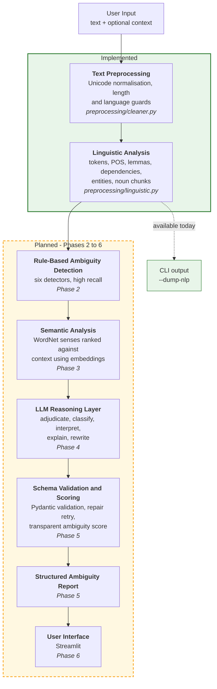

# AmbiSense — NLP-Based Ambiguity Detection and Resolution System

> **Status: Work in progress (Phase 1 of 8 complete).**
> This repository currently contains the configuration foundation and the
> traditional NLP analysis layer. Ambiguity detection, the semantic layer, LLM
> integration, scoring, the web interface and evaluation are **not implemented
> yet** and are clearly marked as planned throughout this document.

---

## Table of Contents

1. [Project Overview](#1-project-overview)
2. [Problem Statement](#2-problem-statement)
3. [Motivation](#3-motivation)
4. [Project Objectives](#4-project-objectives)
5. [How Ambiguity Works](#5-how-ambiguity-works)
6. [Types of Ambiguity the Project Will Handle](#6-types-of-ambiguity-the-project-will-handle)
7. [Proposed System Architecture](#7-proposed-system-architecture)
8. [Current Implementation Status](#8-current-implementation-status)
9. [Phase 0 — Foundation](#9-phase-0--foundation-complete)
10. [Phase 1 — Schemas and NLP Layer](#10-phase-1--schemas-and-nlp-layer-complete)
11. [Installation](#11-installation)
12. [Current CLI Usage](#12-current-cli-usage)
13. [Example Commands](#13-example-commands)
14. [Example NLP Output](#14-example-nlp-output)
15. [Configuration](#15-configuration)
16. [Environment Variables](#16-environment-variables)
17. [Testing](#17-testing)
18. [Project Structure](#18-project-structure)
19. [Design Decisions](#19-design-decisions)
20. [Known Limitations](#20-known-limitations)
21. [Planned Development Phases](#21-planned-development-phases)
22. [Technology Stack](#22-technology-stack)
23. [Future Work](#23-future-work)
24. [License](#24-license)

---

## 1. Project Overview

AmbiSense is an academic prototype that aims to detect ambiguity in English
text, explain why the ambiguity occurs, and suggest clearer rewrites.

The intended design is a **hybrid pipeline**: traditional NLP techniques locate
*candidate* ambiguities using observable linguistic structure, and a Large
Language Model, accessed through an API, then judges whether each candidate is
a genuine ambiguity and produces the interpretations, explanations and
rewrites.

The two components have deliberately separate responsibilities. Rule-based
analysis answers *"where in this sentence is there a structural reason to
suspect more than one reading?"* The LLM answers *"is that reading actually
available to a human reader, and how would you phrase it unambiguously?"*

**What exists today** is the first half of the foundation: configuration
management, input validation, and a spaCy-based linguistic analysis layer that
produces structured, serialisable evidence. Everything downstream of that is
planned work described in [Section 21](#21-planned-development-phases).

---

## 2. Problem Statement

A sentence is **ambiguous** when it has more than one legitimate
interpretation, and the text alone does not determine which one is intended.

```
I saw the man with the telescope.
```

This sentence has two available readings:

- The speaker used a telescope in order to see the man.
- The man the speaker saw was carrying a telescope.

Both readings are grammatically valid. Nothing in the sentence resolves the
question. A human reader usually settles it from context — or fails to notice
the ambiguity at all, which is precisely what makes ambiguity dangerous in
requirements documents, legal text, medical instructions and technical
specifications.

Automatic detection is difficult because:

- A parser typically commits to **one** parse and discards the alternatives,
  so the ambiguity becomes invisible after parsing.
- Most words are technically polysemous, so naive dictionary-based detection
  flags almost every sentence and is therefore useless.
- Not every unclear sentence is ambiguous. Vagueness, underspecification and
  missing context are different problems that require different responses.

This project treats those three difficulties as the core design challenge
rather than as edge cases.

---

## 3. Motivation

Ambiguity is not merely a linguistic curiosity; it has practical cost:

- **Requirements engineering.** An ambiguous specification produces software
  that satisfies the sentence but not the intent.
- **Legal and policy text.** Competing readings of the same clause are a
  recurring source of dispute.
- **Technical writing and documentation.** A reader who picks the wrong
  reading follows the wrong procedure.
- **Language learning.** Learners benefit from seeing *why* a sentence can be
  read in two ways, not just being told it is unclear.

There is also a research motivation. Modern LLMs are strong at explaining
ambiguity in fluent prose but will readily produce a confident explanation for
a sentence that is not actually ambiguous. Traditional NLP is the opposite: it
can reliably identify structural configurations that *permit* two readings, but
cannot tell whether the second reading is plausible to a human. Combining them
lets each component compensate for the other's characteristic failure mode.

---

## 4. Project Objectives

1. Build a modular NLP pipeline that separates linguistic description from
   ambiguity judgement.
2. Extract observable linguistic evidence — POS tags, dependency relations,
   named entities, noun phrases — using established NLP tooling.
3. Implement rule-based detectors for the six ambiguity types listed below.
   *(Planned — Phase 2.)*
4. Use word-sense information and embeddings to analyse whether supplied
   context favours one reading. *(Planned — Phase 3.)*
5. Integrate an LLM through an API so that it reasons over the NLP evidence
   rather than over the raw sentence alone. *(Planned — Phase 4.)*
6. Enforce a strict, validated output schema instead of accepting free-form
   LLM text. *(Schema implemented in Phase 1; the LLM that fills it is
   planned for Phase 4.)*
7. Distinguish ambiguity from vagueness, underspecification and insufficient
   context.
8. Provide a transparent, explainable ambiguity score. *(Planned — Phase 5.)*
9. Evaluate the system on a labelled dataset and report honest metrics.
   *(Planned — Phase 7.)*
10. Document limitations truthfully rather than overstating capability.

---

## 5. How Ambiguity Works

Ambiguity arises when a single surface form maps onto more than one underlying
structure or meaning. It is useful to distinguish it from three neighbouring
phenomena, because a system that conflates them will report false positives
constantly.

| Phenomenon | Definition | Example | Is it ambiguity? |
|---|---|---|---|
| **Ambiguity** | Two or more distinct, well-formed readings | "I saw the man with the telescope." | Yes |
| **Vagueness** | One reading, but with imprecise boundaries | "The movie was good." | No — *good* is subjective, not double-meaning |
| **Underspecification** | One reading, with detail omitted | "They arrived late." | No — we simply are not told who or how late |
| **Insufficient context** | Reading depends on information outside the text | "Put it on the table." | No — *it* is unresolved, not double-meaning |

The practical consequence for this project: a sentence being *unclear* is not
sufficient grounds to report ambiguity. The system must be able to answer
"unclear, but not ambiguous" and to answer "I cannot confidently classify
this". The `ClarityVerdict` and `AmbiguityType.UNKNOWN` values in
[`schemas.py`](src/ambisense/schemas.py) exist specifically to make those two
answers expressible.

---

## 6. Types of Ambiguity the Project Will Handle

> **Status:** the categories below are defined in the implemented schema
> ([`AmbiguityType`](src/ambisense/schemas.py)). The **detectors** that will
> identify them are planned for Phase 2 and are not implemented yet.

### 6.1 Lexical ambiguity

A single word carries more than one meaning.

```
I went to the bank.
```

- A financial institution.
- The sloping land beside a river.

Planned detection signal: words with several distinct WordNet senses for their
part of speech, filtered against a stoplist of words that are technically
polysemous but practically unambiguous.

### 6.2 Syntactic ambiguity

The same word sequence supports more than one grammatical structure.

```
I saw the man with the telescope.
```

- The prepositional phrase attaches to the verb — the telescope was the
  instrument of seeing.
- The prepositional phrase attaches to the noun — the man had the telescope.

A second variety is coordination scope:

```
The old men and women sat outside.
```

- Old men, and women of any age.
- Old men and old women.

Planned detection signal: dependency-parse configurations in which an
alternative attachment point is structurally available.

### 6.3 Referential ambiguity

A pronoun or referring expression has more than one possible antecedent.

```
John told David that he was late.
```

- *he* = John.
- *he* = David.

Planned detection signal: a pronoun with two or more antecedent candidates that
survive number and animacy agreement filtering. The groundwork for this exists
already — the implemented noun-chunk extraction records `is_plural` and
`is_person` for exactly this purpose.

### 6.4 Semantic ambiguity

The sentence is structurally clear but the semantic roles are not fixed.

```
The chicken is ready to eat.
```

- The chicken is about to eat something (chicken = agent).
- The chicken is ready to be eaten (chicken = patient).

Planned detection signal: argument-structure patterns such as an adjective
followed by an infinitive whose transitive verb has no expressed object.

### 6.5 Scope ambiguity

Quantifiers and negation can take scope over one another in more than one order.

```
Every student didn't submit the assignment.
```

- No student submitted it (negation scopes over the quantifier).
- Not all students submitted it (the quantifier scopes over negation).

Planned detection signal: co-occurrence of a quantifier with negation, or with
a second quantifier, within one clause.

### 6.6 Pragmatic / contextual ambiguity

The literal meaning and the intended communicative act differ.

```
Can you open the window?
```

- A literal question about physical ability.
- A polite request to open the window.

Planned detection signal: indirect speech-act patterns, such as a modal
interrogative with a second-person subject.

**An honest caveat.** These six categories overlap, and linguists disagree
about their boundaries. The system is designed to return `unknown` rather than
force a confident label onto a case it cannot classify.

---

## 7. Proposed System Architecture

The diagram shows the **complete planned** pipeline. Only the components
marked *IMPLEMENTED* exist in this repository today.



### Why this shape

The central architectural claim is that the LLM must **not** be the first thing
the text touches. A `User → LLM → Answer` design would make the project an API
wrapper, and it would inherit the LLM's tendency to explain ambiguity that is
not there.

Instead, the rule-based layer is tuned for **high recall and low precision** —
it deliberately over-flags — and the LLM acts as the **precision filter** that
rejects candidates which are structurally possible but not humanly plausible.
Two components with opposite error profiles are composed so that each covers
the other's weakness.

A secondary benefit: because the NLP layer produces findings independently, the
planned system can degrade to an NLP-only report when the API is unavailable,
rather than failing outright. The `allow_degraded_mode` switch already exists
in the configuration in anticipation of this. *(The degraded path itself is
Phase 5 work.)*

---

## 8. Current Implementation Status

| Component | Status | Location |
|---|---|---|
| Configuration loading and validation | **Implemented** | `src/ambisense/config.py` |
| Logging setup | **Implemented** | `src/ambisense/logging_setup.py` |
| Shared Pydantic schemas (all layers) | **Implemented** | `src/ambisense/schemas.py` |
| Input validation and normalisation | **Implemented** | `src/ambisense/preprocessing/cleaner.py` |
| spaCy linguistic analysis | **Implemented** | `src/ambisense/preprocessing/linguistic.py` |
| CLI: `--check-config`, `--dump-nlp` | **Implemented** | `main.py` |
| Automated tests (47) | **Implemented** | `tests/` |
| Rule-based ambiguity detectors | *Planned — Phase 2* | — |
| Detector registry | *Planned — Phase 2* | — |
| WordNet sense inventory | *Planned — Phase 3* | — |
| Embeddings / semantic similarity | *Planned — Phase 3* | — |
| Context-based sense ranking | *Planned — Phase 3* | — |
| LLM API client and providers | *Planned — Phase 4* | — |
| Prompt files | *Planned — Phase 4* | — |
| Structured LLM reasoning and repair retry | *Planned — Phase 4* | — |
| Ambiguity scoring | *Planned — Phase 5* | — |
| End-to-end context-aware analysis | *Planned — Phase 5* | — |
| Streamlit user interface | *Planned — Phase 6* | — |
| Evaluation dataset | *Planned — Phase 7* | — |
| Evaluation metrics | *Planned — Phase 7* | — |
| Deployment | *Not planned for this submission* | — |

**Note on empty directories.** `app/`, `prompts/`, `docs/`, `data/examples/`
and `data/evaluation/` exist in the repository but are currently empty. The
package directories `ambiguity/`, `semantic/`, `llm/`, `llm/providers/`,
`scoring/` and `evaluation/` contain only an `__init__.py` placeholder. They
are scaffolding for the phases above, not implemented modules.

---

## 9. Phase 0 — Foundation (Complete)

Phase 0 established configuration, dependency management and logging.

| File | Purpose |
|---|---|
| `requirements.txt` | Dependencies grouped by role with comments explaining each |
| `pyproject.toml` | Declares `src/ambisense` as an installable package |
| `config/config.yaml` | Central configuration: model names, thresholds, weights, detector switches |
| `.env.example` | Template for secrets; the real `.env` is git-ignored |
| `.gitignore` | Excludes `.env`, `.venv/`, caches and build artefacts |
| `src/ambisense/config.py` | Loads YAML into a typed `Settings` tree; reads secrets from the environment |
| `src/ambisense/logging_setup.py` | Namespaced, idempotent logger configuration |

### Packaging

`pyproject.toml` declares a `src/` layout package so that both `main.py` and
the planned Streamlit app can `from ambisense... import ...` after a single
editable install. This avoids `sys.path` manipulation, which is a common source
of import failures when the same project is launched from two different entry
points.

### Configuration design

Every threshold, model name and weight lives in `config/config.yaml`. No
numeric threshold is hard-coded in `src/`. Configuration is parsed into nested
Pydantic models (`LLMConfig`, `NLPConfig`, `DetectorsConfig`, `ScoringConfig`
and others), so a typo in the YAML produces a validation error naming the
field, rather than a `KeyError` later during analysis.

Note that `config.yaml` already contains settings for planned components — for
example detector thresholds and scoring weights. Those sections are read and
validated today, but nothing consumes them yet.

### Logging

`configure_logging()` is idempotent. This matters for the planned Streamlit
interface, which re-executes the script on every user interaction and would
otherwise attach a duplicate handler each time, producing repeated log lines.

---

## 10. Phase 1 — Schemas and NLP Layer (Complete)

### 10.1 Shared schemas — `src/ambisense/schemas.py`

A single module defines every model that crosses a layer boundary, in four
groups:

1. **Linguistic models** — `TokenInfo`, `SentenceInfo`, `EntityInfo`,
   `NounChunkInfo`, `LinguisticAnalysis`.
2. **Detection models** — `AmbiguityCandidate`, the object the planned
   detectors will emit.
3. **Semantic models** — `SenseOption`, `SenseRanking`, for the planned
   WordNet layer.
4. **LLM contract and report models** — `Interpretation`, `AmbiguityFinding`,
   `LLMAnalysis`, `ScoreBreakdown`, `PipelineDiagnostics`, `AmbiguityReport`.

Groups 2, 3 and 4 are **defined but not yet produced by any code**. They are
written now because the schema is the interface between layers: fixing it early
means each subsequent phase has an explicit contract to implement against.

The models include defensive validators that exist because language models
return imperfect JSON in practice — a type string such as `"structural"`
instead of `"syntactic"`, a confidence expressed as `85` instead of `0.85`, or
a single string where a list is expected. `AmbiguityType.coerce()` maps
recognised near-misses onto known categories and returns `UNKNOWN` for anything
else, which is a truthful answer rather than a guess.

### 10.2 Input validation — `src/ambisense/preprocessing/cleaner.py`

This layer runs **before** any expensive work — before the spaCy model loads,
before any planned WordNet lookup or API call — so that bad input fails
immediately and cheaply, with a message the user can act on.

It performs:

- **Unicode normalisation** (NFKC) and replacement of typographic characters
  such as curly quotes, en/em dashes and non-breaking spaces with ASCII
  equivalents. These characters interfere with parsing and with character
  offsets.
- **Whitespace collapsing**, without altering wording.
- **Emptiness and minimum-length checks.**
- **Maximum-length truncation** at a word boundary, which produces a warning
  rather than an error so that long input degrades instead of failing.
- **An English-only guard**, implemented as the proportion of alphabetic
  characters that are ASCII. Text in Devanagari, Cyrillic or CJK scripts scores
  near zero and is rejected with an explanatory message; English containing a
  few accented characters still passes. This is a deliberately crude heuristic,
  not language identification — see [Known Limitations](#20-known-limitations).
- **Optional context normalisation**, with its own length limit.

Crucially, all offsets reported downstream refer to the *normalised* string,
which is also the string shown back to the user. The two therefore cannot drift
apart, which is what makes reliable span highlighting possible in the planned
interface.

### 10.3 Linguistic analysis — `src/ambisense/preprocessing/linguistic.py`

#### Why spaCy

spaCy provides tokenisation, sentence segmentation, POS tagging,
lemmatisation, dependency parsing and named entity recognition from a single
pipeline in one pass. The planned detectors need all of these, and obtaining
them from one tool avoids reconciling different tokenisations between
libraries — a real source of bugs when, for example, a POS tagger and a parser
disagree about token boundaries.

The `en_core_web_md` model was chosen over `en_core_web_sm` because it ships
300-dimensional word vectors. The planned semantic layer needs embeddings, and
taking them from the model that is already loaded avoids adding a second,
much heavier dependency.

#### What is extracted, and what will consume it

| Technique | Planned consumer |
|---|---|
| Tokenisation | Every detector — span boundaries and character offsets |
| Sentence segmentation | Referential detector — the antecedent search window |
| POS tagging | Lexical detector — WordNet lookup is part-of-speech specific |
| Lemmatisation | WordNet lookup and stoplist matching |
| Dependency parsing | Syntactic and scope detectors — attachment and clause structure |
| Named entity recognition | Referential detector — antecedent candidates |
| Noun-chunk extraction | Referential detector — antecedent candidates |
| Word vectors | Semantic layer — similarity between context and sense glosses |

Two additional attributes are computed per noun chunk, both for the planned
referential detector: `is_plural` (from the fine-grained tag and morphological
features) and `is_person` (from NER labels plus a documented lexicon of role
nouns such as *manager* and *developer*, since spaCy's NER labels only *named*
people, not *the manager*).

#### An illustrative point about why detection is needed

For "I saw the man with the telescope.", spaCy attaches the preposition *with*
to *man*. It has silently committed to one of the two available readings and
discarded the other. The parse itself therefore does not reveal the ambiguity;
the planned detector's job is to recognise that an alternative attachment was
structurally available. This is the concrete reason the project needs a
detection layer rather than just a parser.

**This layer makes no judgement about ambiguity.** It only describes the
sentence.

---

## 11. Installation

Tested on Windows 11 with Python 3.13.

### 1. Clone the repository

```powershell
git clone <your-repository-url>
cd "NLP based ambiguity detector"
```

### 2. Create a virtual environment

```powershell
python -m venv .venv
```

### 3. Activate it

```powershell
.\.venv\Scripts\Activate.ps1
```

If PowerShell blocks the activation script, either run the commands with the
explicit interpreter path shown throughout this README
(`.\.venv\Scripts\python.exe ...`), which needs no activation, or permit local
scripts for the current session:

```powershell
Set-ExecutionPolicy -Scope Process -ExecutionPolicy RemoteSigned
```

### 4. Install dependencies

```powershell
.\.venv\Scripts\python.exe -m pip install --upgrade pip
.\.venv\Scripts\python.exe -m pip install -r requirements.txt
.\.venv\Scripts\python.exe -m pip install -e .
```

The final command installs the project itself in editable mode, which is what
makes `import ambisense` work from `main.py` and from the tests.

### 5. Download the spaCy English model

Required — it is not installed by `requirements.txt`.

```powershell
.\.venv\Scripts\python.exe -m spacy download en_core_web_md
```

### 6. Download the WordNet corpus

Not used by the current code, but `--check-config` reports on it and Phase 3
will require it.

```powershell
.\.venv\Scripts\python.exe -c "import nltk; nltk.download('wordnet'); nltk.download('omw-1.4')"
```

### 7. Configure environment variables

```powershell
copy .env.example .env
```

Then open `.env` and set `LLM_API_KEY`. **This is not required yet** — no code
in the current implementation makes an API call. `--check-config` will report
the key as missing, which is expected at this stage.

### 8. Verify the installation

```powershell
.\.venv\Scripts\python.exe main.py --check-config
.\.venv\Scripts\python.exe -m pytest -q
```

---

## 12. Current CLI Usage

```
python main.py [text] [options]
```

| Option | Status | Description |
|---|---|---|
| `text` | Implemented | Positional argument: the sentence or paragraph to analyse |
| `-c`, `--context` | Implemented | Optional context; currently analysed and printed alongside the main text |
| `--dump-nlp` | Implemented | Print the traditional NLP analysis |
| `--check-config` | Implemented | Validate configuration and environment, then exit |
| `--config PATH` | Implemented | Use an alternative `config.yaml` |
| `--log-level LEVEL` | Implemented | Override the configured logging level |

Running `main.py` with text but **without** `--dump-nlp` currently prints a
message stating that full analysis is implemented in a later phase, and exits
with a non-zero status. Full analysis arrives in Phase 5.

Exit codes: `0` success, `1` user/input error, `2` configuration or setup error.

---

## 13. Example Commands

```powershell
.\.venv\Scripts\python.exe main.py --check-config

.\.venv\Scripts\python.exe main.py --dump-nlp "I saw the man with the telescope."

.\.venv\Scripts\python.exe main.py --dump-nlp "The crane is ready." -c "The crane flew across the lake."

.\.venv\Scripts\python.exe -m pytest -q
```

---

## 14. Example NLP Output

Actual output of:

```powershell
.\.venv\Scripts\python.exe main.py --dump-nlp "I saw the man with the telescope."
```

```text
--- INPUT --------------------------------------------------------------------
I saw the man with the telescope.

--- SENTENCES ----------------------------------------------------------------
  [0] I saw the man with the telescope.

--- TOKENS -------------------------------------------------------------------
    #  TEXT           LEMMA          POS    TAG    DEP          HEAD
  ------------------------------------------------------------------
    0  I              i              PRON   PRP    nsubj        saw
    1  saw            see            VERB   VBD    ROOT         saw
    2  the            the            DET    DT     det          man
    3  man            man            NOUN   NN     dobj         saw
    4  with           with           ADP    IN     prep         man
    5  the            the            DET    DT     det          telescope
    6  telescope      telescope      NOUN   NN     pobj         with
    7  .              .              PUNCT  .      punct        saw

--- NAMED ENTITIES -----------------------------------------------------------
  (none found)

--- NOUN CHUNKS --------------------------------------------------------------
  CHUNK                    ROOT           DEP          PLURAL   PERSON
  I                        I              nsubj        False    False
  the man                  man            dobj         False    True
  the telescope            telescope      pobj         False    False
```

Note token 4: `with` has `HEAD = man`. The parser chose the noun-attachment
reading and did not surface the verb-attachment alternative. No ambiguity is
reported here, because **ambiguity detection is not implemented yet** — this
command shows linguistic description only.

A second example, showing the person heuristic that the planned referential
detector will rely on, from:

```powershell
.\.venv\Scripts\python.exe main.py --dump-nlp "The manager told the developer that he needed to fix the bug."
```

```text
--- NOUN CHUNKS --------------------------------------------------------------
  CHUNK                    ROOT           DEP          PLURAL   PERSON
  The manager              manager        nsubj        False    True
  the developer            developer      dobj         False    True
  that                     that           dobj         False    False
  he                       he             nsubj        False    False
  the bug                  bug            dobj         False    False
```

Both `The manager` and `the developer` are marked as persons and are singular,
making them the two antecedent candidates for *he*. Selecting between them is
Phase 2 and Phase 4 work.

---

## 15. Configuration

All configuration lives in `config/config.yaml`. The sections are:

| Section | Consumed today? | Contents |
|---|---|---|
| `llm` | Read and validated; not used | Provider, model, base URL, temperature, max tokens, timeout, retries, caching |
| `nlp` | **In use** | Language, spaCy model, input length guards, ASCII ratio threshold |
| `embeddings` | Read and validated; not used | Backend selection (`spacy` or `sentence_transformers`) |
| `detectors` | Read and validated; not used | Per-detector on/off switches and their thresholds |
| `semantic_analysis` | Read and validated; not used | Sense-ranking parameters |
| `scoring` | Read and validated; not used | Score weights and thresholds |
| `output` | Read and validated; not used | Degraded-mode and evidence-inclusion switches |
| `logging` | **In use** | Level and format |

Sections marked "read and validated; not used" are loaded into typed objects
and checked for consistency at startup, but no current code path consumes them.
They are present so that each planned phase has its configuration already in
place.

The default LLM provider is **Groq**, chosen because it offers a free tier
suitable for a student project. Because Groq, OpenAI, Google Gemini and a local
Ollama server all expose an OpenAI-compatible endpoint, switching provider is
intended to require changing only `provider`, `model` and `base_url`.
*(The client that will use these values is Phase 4 work.)*

---

## 16. Environment Variables

Secrets are never stored in `config.yaml` or in source code. Copy
`.env.example` to `.env` and fill it in; `.env` is git-ignored.

| Variable | Required | Purpose |
|---|---|---|
| `LLM_API_KEY` | Not yet — required from Phase 4 | API key for the configured provider |
| `LLM_PROVIDER` | Optional | Overrides `llm.provider` from the YAML |
| `LLM_MODEL` | Optional | Overrides `llm.model` |
| `LLM_BASE_URL` | Optional | Overrides `llm.base_url` |
| `LOG_LEVEL` | Optional | Overrides `logging.level` |

The optional overrides exist so that a provider can be switched during a live
demonstration without editing the YAML file.

---

## 17. Testing

The current implementation has **47 automated tests**, all passing.

```powershell
.\.venv\Scripts\python.exe -m pytest -q
```

```text
47 passed
```

**Scope of these tests.** They cover the foundation and NLP layer only —
specifically:

- `tests/test_schemas.py` — type and verdict coercion, confidence clamping,
  rewrite-list cleaning, and validation of a well-formed and an empty LLM
  payload against the schema.
- `tests/test_preprocessing.py` — Unicode normalisation, every input guard,
  spaCy annotation correctness, sentence segmentation, character-offset
  integrity, the person heuristic, entity extraction and dependency-tree
  traversal.

They do **not** test ambiguity detection, semantic analysis, LLM integration,
scoring, the interface or evaluation, because none of those exist yet.

**No test makes an API call.** The LLM-contract tests validate the schema
against hand-written payloads, so the suite runs offline, costs nothing and is
deterministic. This is a deliberate property to preserve as later phases add
the API client.

One bug was found and fixed by these tests during development: a confidence
value of `1.4` returned by a model was being interpreted as "1.4 percent" and
collapsed to `0.014`, turning a confident answer into a near-zero one. The
percentage heuristic now requires a documented floor before treating a number
as a percentage.

---

## 18. Project Structure

This is the **actual** current contents of the repository. Empty directories
and placeholder `__init__.py` files are marked as such.

```
NLP based ambiguity detector/
│
├── main.py                              # CLI entry point
├── pyproject.toml                       # Package definition
├── requirements.txt                     # Dependencies
├── README.md                            # This file
├── .env.example                         # Secret template
├── .gitignore
│
├── config/
│   └── config.yaml                      # All configuration
│
├── src/
│   └── ambisense/
│       ├── __init__.py
│       ├── config.py                    # Typed settings loader
│       ├── logging_setup.py             # Logger configuration
│       ├── schemas.py                   # All Pydantic models
│       │
│       ├── preprocessing/
│       │   ├── __init__.py
│       │   ├── cleaner.py               # Validation and normalisation
│       │   └── linguistic.py            # spaCy analysis layer
│       │
│       ├── ambiguity/
│       │   └── __init__.py              # (placeholder - Phase 2)
│       ├── semantic/
│       │   └── __init__.py              # (placeholder - Phase 3)
│       ├── llm/
│       │   ├── __init__.py              # (placeholder - Phase 4)
│       │   └── providers/
│       │       └── __init__.py          # (placeholder - Phase 4)
│       ├── scoring/
│       │   └── __init__.py              # (placeholder - Phase 5)
│       └── evaluation/
│           └── __init__.py              # (placeholder - Phase 7)
│
├── tests/
│   ├── __init__.py
│   ├── test_schemas.py                  # 
│   └── test_preprocessing.py            # 47 tests in total
│
├── app/                                 # (empty - Phase 6)
├── prompts/                             # (empty - Phase 4)
├── docs/                                # (empty - Phase 8)
└── data/
    ├── examples/                        # (empty - Phase 6)
    └── evaluation/                      # (empty - Phase 7)
```

### Planned structure

Files expected to be added in later phases:

```
src/ambisense/
├── pipeline.py                          # Phase 5 - orchestrator
├── ambiguity/
│   ├── base.py                          # Phase 2 - detector protocol
│   ├── registry.py                      # Phase 2 - config-driven registry
│   ├── lexical.py, syntactic.py,        # Phase 2 - the six detectors
│   ├── referential.py, semantic.py,
│   ├── scope.py, pragmatic.py
├── semantic/
│   ├── wordnet_senses.py                # Phase 3
│   ├── embeddings.py                    # Phase 3
│   └── context_resolver.py              # Phase 3
├── llm/
│   ├── client.py                        # Phase 4
│   ├── prompt_builder.py                # Phase 4
│   ├── parser.py                        # Phase 4 - validation + repair retry
│   └── providers/
│       ├── openai_compatible.py         # Phase 4
│       └── anthropic.py                 # Phase 4
├── scoring/
│   └── ambiguity_score.py               # Phase 5
└── evaluation/
    ├── metrics.py                       # Phase 7
    └── run_detection_eval.py            # Phase 7

prompts/
├── ambiguity_analysis.txt               # Phase 4
├── rewrite_generation.txt               # Phase 4
└── json_repair.txt                      # Phase 4

app/streamlit_app.py                     # Phase 6
data/examples/demo_sentences.json        # Phase 6
data/evaluation/gold_set.jsonl           # Phase 7
```

---

## 19. Design Decisions

### 19.1 spaCy `Doc` objects do not leave the preprocessing layer

`LinguisticAnalyzer.analyze()` converts spaCy's `Doc` into plain Pydantic
models (`TokenInfo`, `EntityInfo`, `NounChunkInfo`, `SentenceInfo`, assembled
into a `LinguisticAnalysis`) before returning. No spaCy object crosses the
layer boundary.

This is a small amount of extra code that buys five things:

1. **Separation of concerns.** The preprocessing layer owns the dependency on
   spaCy. Nothing downstream imports spaCy or knows the version in use.
2. **Serialisability.** A `Doc` cannot be converted to JSON directly. A
   `LinguisticAnalysis` can, via `.model_dump_json()`. The planned LLM prompt
   builder needs exactly that: linguistic evidence embedded as text in a
   prompt. Passing plain models makes that a one-line operation instead of a
   bespoke extraction routine.
3. **Easier testing.** The planned detectors can be tested by constructing
   small `LinguisticAnalysis` fixtures by hand. Those tests need no spaCy
   model, run in milliseconds, and are not affected by model version changes.
4. **Detector independence.** Detectors depend on a schema this project
   controls, not on a third-party API. If spaCy's attribute names changed, or
   if a different parser were substituted, only `linguistic.py` would change.
5. **A stable contract.** The `LinguisticAnalysis` helper methods
   (`children_of`, `tokens_in_sentence`, `token_by_index`) give detectors a
   small, explicit vocabulary for walking the parse instead of each detector
   reimplementing tree traversal.

The cost is one conversion pass per analysis, which is negligible relative to
the parse itself.

### 19.2 Configuration validation checks semantic constraints, not just structure

Loading YAML into Pydantic already catches structural problems: a missing
field, a string where a number was expected. `_validate_consistency()` in
`config.py` adds three checks that YAML parsing and type validation cannot
catch, because each involves a relationship *between* values:

1. The four `scoring.weights` must sum to `1.0` within a small tolerance.
   Individually each is a perfectly valid float; only together are they wrong.
   Weights summing to, say, `1.3` would silently distort every ambiguity score
   the system ever produces.
2. `embeddings.backend` must be one of the two backends the project actually
   implements, so an unrecognised value fails at startup rather than when the
   semantic layer is first invoked.
3. `nlp.max_input_length` must not be below `nlp.min_input_length`, a
   combination that would reject all input.

The benefit is that these mistakes surface immediately when `--check-config`
runs, rather than partway through a demonstration. This is a modest
consistency check on a handful of fields — not a general-purpose configuration
verification system.

---

## 20. Known Limitations

### Limitations of the current implementation

- **No ambiguity detection exists yet.** The system currently describes
  sentences; it does not analyse them for ambiguity.
- **The language guard is a heuristic, not language identification.** It
  measures the proportion of ASCII alphabetic characters. Romanised text in
  another language — for example Hindi written in Latin script — will pass the
  guard and then be analysed by an English model, producing unreliable output.
- **The animacy lexicon is a fixed, hand-written list.** Role nouns absent from
  `PERSON_NOUNS` will not be marked as persons, which will cause the planned
  referential detector to miss antecedents.
- **`--context` is accepted and analysed but does not yet influence anything.**
  Context-based disambiguation is Phase 3 and Phase 5 work.
- **Parser errors propagate.** Dependency parsing is statistical and
  imperfect; a wrong parse will mislead the planned detectors that read it.

### Limitations expected to persist in the finished system

These are inherent to the problem and will be restated, with evidence, once
evaluation has actually been run:

- **English only.** No multilingual support is planned for this submission.
- **Sarcasm, irony and humour** depend on speaker intent and shared knowledge
  that is not recoverable from the sentence.
- **Cultural and pragmatic interpretation** varies between communities; there
  is often no single correct reading.
- **Domain-specific language.** Technical jargon may be flagged as lexically
  ambiguous when it is perfectly clear to a specialist reader.
- **False positives and false negatives are both expected.** The rule-based
  layer is deliberately over-inclusive, and the LLM filter will not be
  perfectly accurate.
- **LLM reasoning is not authoritative.** An LLM can produce a fluent,
  confident explanation of an ambiguity that does not exist. This is the
  specific failure the hybrid architecture is designed to mitigate — mitigate,
  not eliminate.
- **The planned ambiguity score is project-specific.** It will be a weighted
  combination defined by this project, not a recognised linguistic measurement,
  and it will be documented as such.

**No performance claims are made in this document.** No evaluation has been
run, and no metrics exist yet.

---

## 21. Planned Development Phases

| Phase | Name | Status |
|---|---|---|
| 0 | Foundation — packaging, configuration, logging | **Complete** |
| 1 | Schemas and NLP layer | **Complete** |
| 2 | Rule-based ambiguity detection — six detectors plus registry | **Next** |
| 3 | Semantic analysis — WordNet senses, embeddings, context-based sense ranking | Planned |
| 4 | LLM integration — prompt files, provider-agnostic client, structured output validation and repair | Planned |
| 5 | Context-aware reasoning and ambiguity scoring — pipeline orchestrator, transparent score, degraded mode | Planned |
| 6 | User interface — Streamlit application with span highlighting and demo examples | Planned |
| 7 | Evaluation — labelled dataset, accuracy/precision/recall/F1, manual review of explanations and rewrites | Planned |
| 8 | Documentation, testing and final polish | Planned |

Phase 2 is the next piece of work. It will add the detector protocol, the six
detectors, a configuration-driven registry, a `--detect-only` CLI mode and unit
tests for each detector.

---

## 22. Technology Stack

### Currently used

| Technology | Version | Role |
|---|---|---|
| Python | 3.13 | Language |
| spaCy | 3.8.x | Tokenisation, POS, lemmas, dependency parsing, NER, noun chunks |
| `en_core_web_md` | 3.8.0 | English model with 300-dimensional word vectors |
| Pydantic | 2.x | Typed models, validation, serialisation |
| PyYAML | 6.x | Configuration parsing |
| python-dotenv | 1.x | Loading secrets from `.env` |
| pytest | 9.x | Test framework |

### Installed, reserved for later phases

| Technology | Intended role | Phase |
|---|---|---|
| NLTK (WordNet) | Word-sense inventory and glosses | 3 |
| NumPy | Cosine similarity for sense ranking | 3 |
| httpx | HTTP transport for the LLM API | 4 |
| scikit-learn | Evaluation metrics | 7 |
| Streamlit | User interface | 6 |

### Deliberately excluded

- **LangChain** — adds a layer of indirection that would have to be explained
  and defended, for a project that makes one kind of API call.
- **`transformers` / `torch`** — a large dependency. The `en_core_web_md`
  vectors are sufficient for the planned gloss-similarity comparison. The
  configuration leaves a `sentence_transformers` backend selectable if this
  proves inadequate.
- **Constituency parsers and neural coreference libraries** — added
  installation risk with no Python 3.13 guarantee, for functionality the
  dependency-based approach approximates adequately.

---

## 23. Future Work

Beyond the eight planned phases, the following would be reasonable extensions
and are **not** part of this submission:

- Paragraph-level and cross-sentence ambiguity, including referential chains
  spanning several sentences.
- Comparing the rule-based layer against the LLM's verdicts to quantify where
  the rules over-trigger, which would be an informative piece of analysis in
  its own right.
- A comparison of the two embedding backends on the same evaluation set.
- Support for languages other than English.
- Domain adaptation — for example a mode tuned for software requirements, where
  the cost of an undetected ambiguity is high.
- Inter-annotator agreement on the evaluation dataset. The planned dataset will
  be labelled by a single annotator, which is a genuine methodological
  limitation.
- Response caching and batch processing of documents.

---

## 24. License

This project is submitted as academic coursework.

Third-party components retain their own licences: spaCy (MIT), the
`en_core_web_md` model (MIT), NLTK (Apache 2.0), WordNet (WordNet 3.0 licence),
Pydantic (MIT) and Streamlit (Apache 2.0).

---

*AmbiSense is an academic research prototype. It does not claim to understand
language, and it will not detect every ambiguity or correctly judge every
sentence.*
